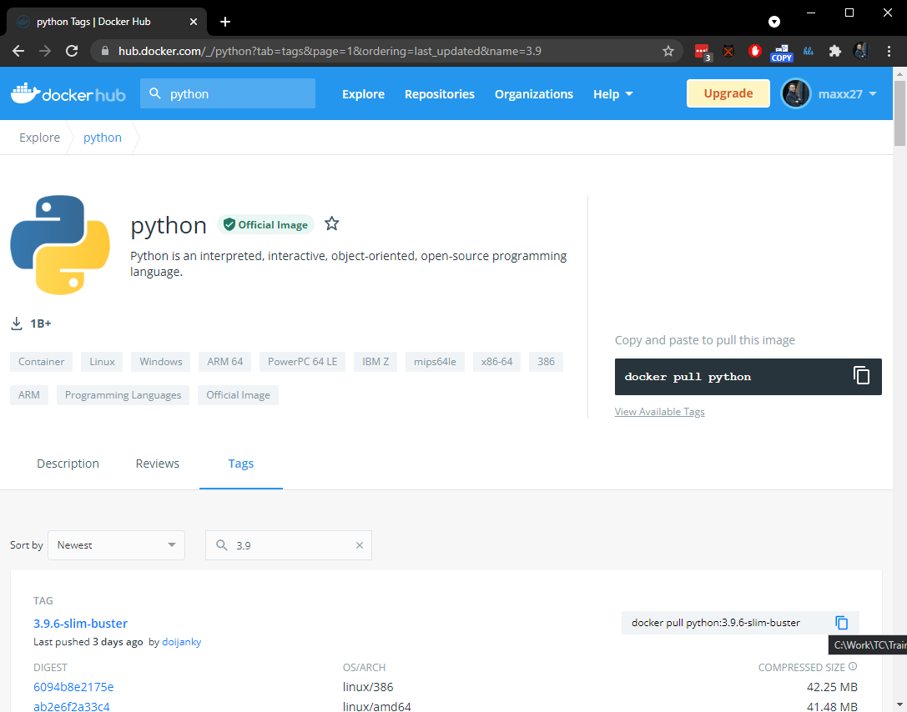

# Run container

## Part 1

1. Search on [hub.docker.com](https://hub.docker.com/) for `python`.
2. List tags. Find the latest 2.x and 3.x versions.
3. Run them interactively without `--rm`:

```console
$ docker container run -it python:VERSION
```

4. Check the Python version:

```python
>>> import sys
>>> sys.version_info
>>> exit()
```

5. Find stopped containers.
6. Clean the stopped containers.

## Part 2

1. Run the same containers but using `--rm` argument.
2. Exit from the containers.
3. Find stopped containers.

# Solution

## Part 1

1,2. Here for Python 3.x, the latest stable version is `3.9`:



For Python 2.x, the latest version is `2.7.18`.


3,4. Run them interactively without `--rm` to check the Python version inside the images:

```console
$ docker container run -it python:2.7
Unable to find image 'python:2.7' locally
2.7: Pulling from library/python
7e2b2a5af8f6: Pull complete
09b6f03ffac4: Pull complete
dc3f0c679f0f: Pull complete
fd4b47407fc3: Pull complete
b32f6bf7d96d: Pull complete
6f4489a7e4cf: Pull complete
af4b99ad9ef0: Pull complete
39db0bc48c26: Pull complete
acb4a89489fc: Pull complete
Digest: sha256:cfa62318c459b1fde9e0841c619906d15ada5910d625176e24bf692cf8a2601d
Status: Downloaded newer image for python:2.7
Python 2.7.18 (default, Apr 20 2020, 19:27:10)
[GCC 8.3.0] on linux2
Type "help", "copyright", "credits" or "license" for more information.
>>> import sys
>>> sys.version_info
sys.version_info(major=2, minor=7, micro=18, releaselevel='final', serial=0)
>>> exit()

$ docker container run -it python:3.9
Unable to find image 'python:3.9' locally
3.9: Pulling from library/python
627b765e08d1: Already exists
c040670e5e55: Already exists
073a180f4992: Already exists
bf76209566d0: Already exists
ca7044ed766e: Already exists
7b16520e0e66: Already exists
e121e5a178df: Already exists
abbaf10bd160: Already exists
6e08db598049: Already exists
Digest: sha256:c9ce68ae7538edcd5f803c19aebcf0bba47ebed122f373284aadfa1a3e071b4c
Status: Downloaded newer image for python:3.9
Python 3.9.6 (default, Jul 22 2021, 15:16:20)
[GCC 8.3.0] on linux
Type "help", "copyright", "credits" or "license" for more information.
>>> import sys
>>> sys.version_info
sys.version_info(major=3, minor=9, micro=6, releaselevel='final', serial=0)
>>> exit()
```

5. Find stopped containers.

```console
$ docker container ls -f "status=exited"
CONTAINER ID   IMAGE        COMMAND     CREATED         STATUS                     PORTS     NAMES
8844e06a4f0b   python:3.9   "python3"   2 minutes ago   Exited (0) 2 minutes ago             determined_lalande
94aec8b62153   python:2.7   "python2"   4 minutes ago   Exited (0) 4 minutes ago             boring_benz
```

6. Clean the stopped containers.

```console
$ docker container rm -f 8844e06a4f0b 94aec8b62153
8844e06a4f0b
94aec8b62153
```

## Part 2

1,2. Run the same containers but using `--rm` argument.

```console
$ docker container run -it --rm python:2.7
Python 2.7.18 (default, Apr 20 2020, 19:27:10)
[GCC 8.3.0] on linux2
Type "help", "copyright", "credits" or "license" for more information.
>>> exit()

$ docker container run -it --rm python:3.9
Python 3.9.6 (default, Jul 22 2021, 15:16:20)
[GCC 8.3.0] on linux
Type "help", "copyright", "credits" or "license" for more information.
>>> exit()
```

3. Find stopped containers.

```console
$ docker container ls -f "status=exited"
CONTAINER ID   IMAGE     COMMAND   CREATED   STATUS    PORTS     NAMES
```

Nothing was found because containers were removed.
